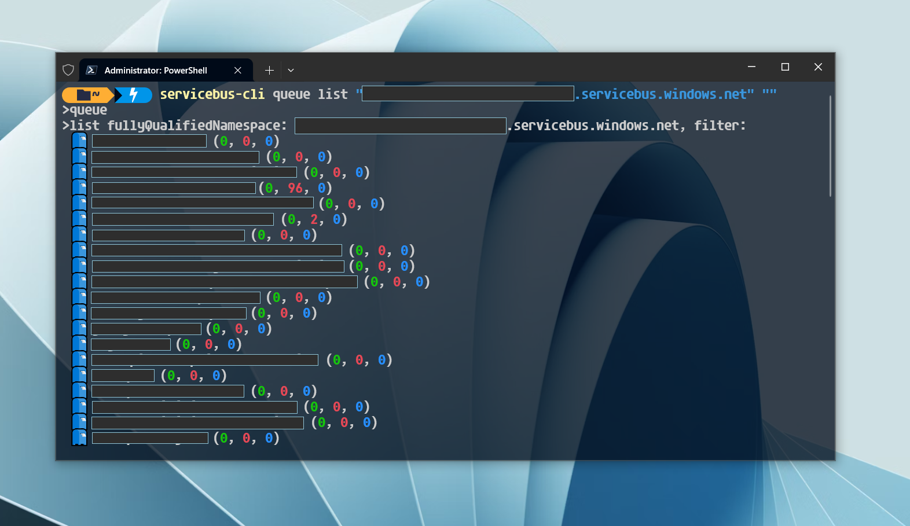

<h1 align="center">
servicebus-cli
</h1>

<p align="center">
	<a href="https://github.com/wenzzzel/servicebus-cli/stargazers"></a>
	<a href="https://github.com/wenzzzel/servicebus-cli/issues"></a>
	<a href="https://github.com/wenzzzel/servicebus-cli/contributors"></a>
</p>
<p align="center">
	
<i><small><span style="color:green">Green</span> numbers = Messages, <span style="color:red">Red</span> numbers = Dead letters, <span style="color:blue">Blue</span> numbers = Scheduled messages</small></i>
</p>
<h2>
📃 About
</h2>
<p>
Servicebus Cli is a command line interface for working with Azure Service Bus.
</p>

<h2>
🚦 Usage
</h2>
<p>
The application syntax is split into <code>subjects</code> and <code>actions</code>. The first parameter is always the <code>subject</code> and second parameter is the <code>action</code>. All parameters after that are <code>parameters</code> passed to the action.
</p>

<p>
To see all available commands simply use subject <code>help</code>with no actions or parameters
</p>

```
servicebus-cli help
```
<p>The output will be as follows:</p>

```
Syntax: servicebus-cli <subject> <action> <parameter1> <parameterX> ...

The following subjects and actions are available:
 - deadletter
    - resend
        - <FullyQualifiedNamespace>
        - <EnitityPath>
        - <UseSessions> (Y/N)
    - purge
        - <FullyQualifiedNamespace>
        - <EnitityPath>
 - queue
    - list
        - <FullyQualifiedNamespace>
        - <Filter>
    - show
        - <FullyQualifiedNamespace>
        - <QueueName>
Example: servicebus-cli deadletter resend <FullyQualifiedNamespace> <EnitityPath>
```

<h2>
📌 Examples
</h2>
<p>List all service bus queues on namespace <code>my-namespace.servicebus</code></p>

```
servicebus-cli queue list "my-namespace.servicebus.windows.net" ""
```
<p>List all service bus queues on namespace <code>my-namespace.servicebus</code> with a name containing <code>my-queue</code></p>

```
servicebus-cli queue list "my-namespace.servicebus.windows.net" "my-queue"
```
<p>Show the service bus queue called <code>my-queue</code> on namespace <code>my-namespace</code></p> 

```
servicebus-cli queue show "my-namespace.servicebus.windows.net" "my-queue"
```
<p>Purge all dead letter messages in namespace <code>my-namespace</code> on queue <code>my-entity-path</code> </p>

```
servicebus-cli deadletter purge "my-namespace.servicebus.windows.net" "my-entity-path"
```
<p>Resend all dead letter messages in namespace <code>my-namespace</code> on queue <code>my-entity-path</code> using Sessions</p>

```
servicebus-cli deadletter resend "my-namespace.servicebus.windows.net" "my-entity-path" "Y"
```
<p>Resend all dead letter messages in namespace <code>my-namespace</code> on queue <code>my-entity-path</code> without Sessions</p>

```
servicebus-cli deadletter resend "my-namespace.servicebus.windows.net" "my-entity-path"
```